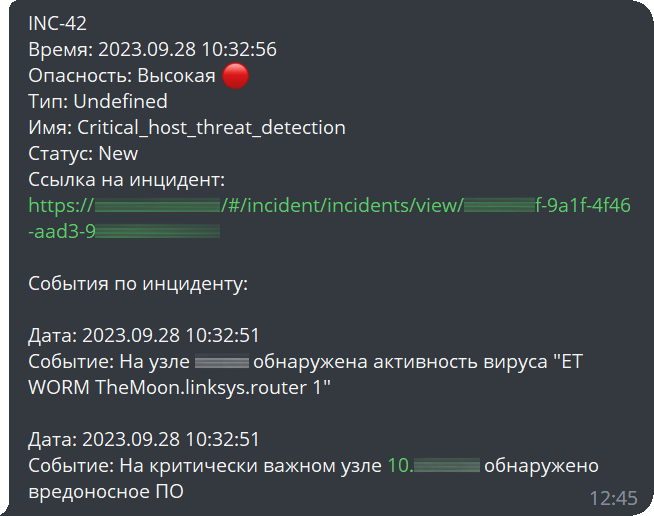

# MPSIEM-Telegram-notification

Отправка инцидентов из MaxPatrol SIEM 10 в Telegram бот.

Написано для версии 26.0.4827, обновлено на версии 26.1.7351.



## Настройки

В файле ```settings.py``` находятся настройки бота:

- dbFileName - путь к файлу, в котором будут сохранятся данные бота (временные метки последних инцидентов, событий в ТГ, разрешенные чаты)
- pause_time - время в секундах между проверками инцидентов
- time_zone - часовой пояс (в SIEM события хранятся с временем по GMT+0, соответсвенно для отображения времени по Москве нужно задать +3 часа)
- username - имя пользоватея в SIEM
- password - пароль пользователя в SIEM
- client_id - идентификатор приложения (mpx, ptkb)
- client_secret - ключ доступа к приложению в SIEM
- base_url - url для входа в SIEM
- tg_bot_token - токен Телеграм-бота
- tg_updates_timeout - время ожидания новых событий в Телеграм
- admin_chat_id - id чата с администратором в Телеграм
- default_header - заголовок запросов, с которыми будет обращаться бот к SIEM
- ping_sticker - ссылка на GIF-анимацию или file_id, которую пришлет бот в ответ на команду /ping в Telegram


client_secret для авторизации скрипта в SIEM можно взять в конфигурации Core (*/var/lib/deployed-roles/mp10-application/core-##########/install.sh*)

tg_bot_token для работы бота можно получить у https://t.me/BotFather

Для получения chat_id можно написать своему боту любое сообщение, затем перейти по ссылке вида *https://api.telegram.org/bot123456:ABC-DEF1234ghIkl-zyx57W2v1u123ew11/getUpdates*, где *123456:ABC-DEF1234ghIkl-zyx57W2v1u123ew11* это токен вашего бота Телеграм, там вы найдете chat/id.

## Запуск

Запуск скрипта возможен как на удаленной машине, так и на машине с SIEM.

Для запуска по SSH рекомендую использовать следующую команду: 
```nohup python3 mp-siem-tg-bot-notification.py &```

При первом запуске файл БД будет создан автоматически по пути, указанному в параметре dbFileName в файле ```settings.py```.

После создания файла БД таблица tg_users_allowed не содержит записей (т.е. оповещения об инцидентах не будут отправлять никому). Когда какой-либо пользователь нажмет кнопку "Старт" в боте или отправит команду ```/start```, администратор получит сообщение вида:
```
Обнаружены новые пользователи бота: 
@Nickname (разрешить просмотр логов /accept123456789, игнорировать /deny123456789).
```
Отправив команду ```/accept123456789``` (где 123456789 это id пользователя Телеграм) администратор добавляет пользователя в список рассылки новых инцидентов.

Отправив команду ```/deny123456789``` (где 123456789 это id пользователя Телеграм) администратор исключает пользователя из списка рассылки новых инцидентов (команда применима в любой момент).

Если администратор не отправил ни одну из команд, пользователь не будет включен в список рассылки новых инцидентов.

Для включения администратора в список рассылки новых инцидентов он тоже должен включить себя в него командой ```/accept123456789```.

Для ускорения этого процесса администратор может просто отправить повторно команду ```/start```, после чего он получит описанное ранее сообщение с возможностью добавить себя в список рассылки.

## Работа бота

Бот авторизуется в SIEM и получает токен, с которым осуществляет все дальнейшие обращения к SIEM по API.

Если токен закончится (обычно через 24 часа) и будет получена ошибка 401 (Unauthorised), будет выполнен новый запрос на получение токена.

Если в SIEM появляются новые инциденты, информация о них отправляется пользователям бота. Для исключения неавторизованного доступа к боту, после запуска бот отправляет оповещения только разрешенным администратором пользователям.

Администратором является пользователь, указанный в параметре admin_chat_id в файле ```settings.py```.

Если новый пользователь начинает работу с ботом (команда ```/start```), то администратору бота приходит оповещение о новом пользователе и выбором - разрешить или запретить ему получение оповещений об инцидентах.

В случае добавления бота в чат, администратор так же получит оповещение с выбором, отправлять ли оповещения в новый чат. В связи с особенностью обработки синтаксиса клиентом Телеграм, команду виду ```/accept-123456789``` желательно ввести вручную, не забыв указать знак минуса.

В Telegram боту можно отправить команду ```/ping``` для проверки работоспособности бота.

Для отладки и для отображения текущих переменных бота администратор может послать ему команду ```/debug```.
